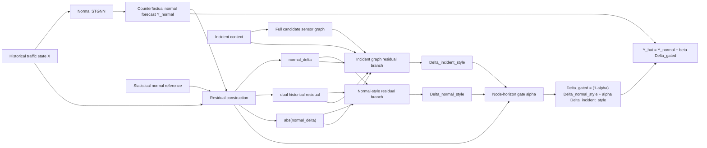

# Method Diagram

## Caption Draft

Overall architecture of the latent-incident mediated dual-branch residual-gating model. A normal STGNN first estimates the counterfactual traffic state under regular conditions. The model then constructs residual features against the learned and statistical normal references. Instead of asking two branches to predict the full traffic state from identical inputs, both branches operate in residual-impact space: a normal-style residual branch captures mild or ordinary deviations, while an incident graph branch captures spatially propagated incident impact on the full candidate graph. A node-horizon gate adaptively fuses the two residual explanations before adding the gated residual back to the normal forecast.
